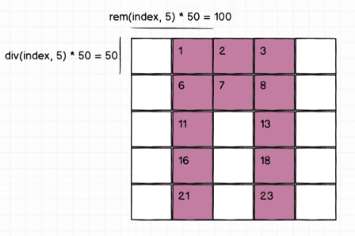

# Elixir class

Repositorio con el codigo de la clase

https://github.com/StephenGrider/ElixirCode

dicord

https://discord.gg/vvcyvjDkdC


# Instalacion tools

## Instalacion de erlang/elixir

1. Agregar repositotio


```
wget https://packages.erlang-solutions.com/erlang-solutions_2.0_all.deb && sudo dpkg -i erlang-solutions_2.0_all.deb
```

2. Actualizar repositorio

``` shell
sudo apt-get update

```

3. instalar earlang/OTP

```
sudo apt-get install esl-erlang

sudo apt-get install esl-erlang=1:20.3.8.26-1

```

4. instalar elixir

```
sudo apt-get install elixir

Nota: las versiones de phoniex estan asociadas a una version de elixir
en ubuntu las versiones cambian la version de erlang/otp que previamente se tenga installado

para la version 5.1.9 de phoniex se uso Elixir 1.10.2 y OTP 24

para obtener las versiones que se encuentran disponibles de eclipse usar  

apt list -a elixir

```


## Generacion de un projecto con elixir


Elixir contiene una herramienta llamada mix que contiene:

1. crear proyectos
2. compilacion de proyectos
3. ejecutar tareas: como la generacion de documentacion
4. Administrar dependencias


### Generacion de un proyecto

extencion ex es para codigo compilado

extension exs es para codigo interpretado

1. Generacion de proyecto con mix

```
mix new projectname
```
Se genera una carpeta dentro de cards contiene

   lib -> con la definicion de un modulo  
   test   
   formatter.exs  
   mix.exs  

2. en el archivo (mismo nombre del proyecto)cards.ex crear una un metodos para realizar una prueba

``` elixir 
defmodule Cards do
    def hello do
        "hi there!!"
    end
end
```

3. Abrir interactive elixir shell
``` elixir
iex -S mix

```
iex -S mix

se puede realizar llado al modulo
Cards.hello

no requiere de parentesis   
en el metodo no requiere que exista un return en el ultimo stament

## Comandos

1. Para actualizar cambios una vez que ya esta abierta la consola utilizar el comando

```
recompile
```

## Diferencias entre Object oriented vs Functional Programming

1. Los modulos son un arreglo de collecciones   
2. Se puede tener metodos con el mismo nombre pero con direntes  
parametros
3. es posible usar variables pero no hay referencias
5. una variable es inmutable una vez que es creada
6. patter matching es un remplazo en elixir para asignacion de variables 


```
##se asignan dos o mas valores en el retorno de una funcion

{status,library} = File.read(filename)


## en caso de tener una constante en la asignacion solo se permite si el   
el valor asignado es el mismo  

["red",color] = ["red","azul"]

```

7. evitar el uso de if, en lugar usar cases o patter matching
 
 ``` elixir
def load_file do
    {status,binary} = File.read(filename)

    case status do
    :ok -> :erlang.binary_to_term binary
    :error -> "That file do not exist"
    end

end

 ```
## Elixir documentacion

Usar la version Stable

Elixir contiene varias documentaciones:

Elixir - standar library: trabajar con collecciones, excepciones, protocols

EEx - template library: permite usar codigo elixir dentro de cadenas  

ExUnit - unit test library: trabajar con pruebas unitarias  

IEx - comandos de la consola iterativa

Logger - logger integrado  

Mix  -  contruir, ejecutar codigo elixir   


## Tuplas  

Hay operaciones en las cuales se utilizan indices, 

``` elixir
 #se optiene el arreglo separo en las dos variables
 #en la primera variable se optiene de 0 a hand_size
 # en la segunda variable se optiene el resto del arreglo
 {hand,rest_of_deck}  = Enum.split(deck,hand_size)

```

``` elixir
 #se optiene el valor

 [color1] = ["red"]
 
``` 

## Cases staments

Las funciones que pueden generar un error durante su ejecucion  
retornan un codigo con el status el cual es un una variable atom  
las cuales pueden son validadas en case

 ``` elixir
def load_file do
    {status,binary} = File.read(filename)

    case status do
    :ok -> :erlang.binary_to_term binary
    :error -> "That file do not exist"
    end

end

 ```

 tambien es posible utilizar directamente el llado en el case,  
 la unica condicion es que cumpla con el patter matching  
 por lo

``` elixir
### usar underscore para indicar que la variable no sera utilizada
### de esta forma se evitan los warnnings cuando la una variable no se utiliza
def load(filename) do
    case File.read(filename) do\
        {:ok,binary} -> :erlang.binary_to_term binary
        {:error, _reason} -> "That file do not exist"
    end
end

```


### Pipe operator

El operador pipe permite enviar el contenido de una  
funcion a otra funcion para que la utilice el retorno  
como data de entrada.

Para poder utilizar este operador requiere considerar  el disenio de los parametros, por lo cual el primer
parametro concidererlo el mas importante


ejemplo de una funcion que hace uso de otras funciones  
sin utilizar pipes

``` elixir

def create_hand(hand_size) do
Deck = Cards.create_deck
deck = Cards.shuffle(deck)
hand = Cards.deal(deck,hand)
end

```
ejemplo utilizando pipes, de esta forma ya no
se crean variables intermedias

``` elixir
def create_hand(hand_size) do
    Card.crate_deck\
    |> Card.suffle
    |> Cards.deal(hand)
    
end

```

## Documentacion de modulos

Ayuda a dar mantenimiento y ayudar a entender  
a otros desarrolladores como usar el codigo  

Se realiza mediante dos pasos:  

1. instalar el paquete xDock: El proposito es generar la  
documentacion automaticamente

2. Generar html file con el resumen de los modulos

intalacion

1. Editar mix , en la seccion deps agregar la nueva  
dependencia

``` elixir
  # Run "mix help deps" to learn about dependencies.
  defp deps do
    [
      {:ex_doc, "0.12"}
      # {:dep_from_hexpm, "~> 0.3.0"},
      # {:dep_from_git, git: "https://github.com/elixir-lang/my_dep.git", tag: "0.1.0"}
    ]
  end
```

2. ejecutar el comando  

```
mix deps.get
```

Ejemplo de como escribir la documantacion del modulo  

``` elixir
def module Cards do
@moduledoc """
Provides methods for creating and handling a deck of cards
"""

end
```


Ejemplo documentacion de un metodo
``` elixir
def module Cards do
@moduledoc """
Provides methods for creating and handling a deck of cards
"""
    @docs """
        Returns a list of strings representing a deck of playing cards
    """
    def create_deck do

        values = ["Ace","Two","Three","Four"]
        suits = ["Spades","Clubs","Heart"]

        for suit <- suits, value <- values do
            "#{value} of #{suit}"
        end
    end
end

```

Una buena practica es agregar un ejemplo de como se puede
utilizar un metodo

``` elixir

@doc """
    Divides a deck into a hand and the remainder of the deck,  
    The `hand_size` argument indicates how many cards should  
    be in the hand


"""
def deal (deck,hand_size) do
Enum.split(deck.hand_size)
end
```

Comando para generar la documentacion de un modulo

``` elixir
mix docs
```

## Testing

A diferencia de otros lenguajes elixir contiene  
integrado la parte de pruebas unitarias

al crear un proyecto con elixir se crear una carpeta
llamada test en la cual se incluyen los siguientes  
archivos

1. proyectname_test: para creat pruebas especificas del proyecto  
2. test_helper: para configuarar configuraciones globales  
de pruebas

Para realizar la ejecucion de las pruebas se utiliza el  
comando

Los ejemplos de la documentacion tambien se validan  
como pruebas de ejecucion a esto se le llama DocTesting


se puede usar assert para validar que son iguales  
 
se puede usar refute para validar que no son  
iguales

``` elixir
mix test
```

## Maps
Son colecciones clave valor

``` elixir

colors=%{primary:"red",secondary:"blue"}
colors.primary
colors.secondary
second_color=colors.secondary

##es posible asignar parte de una mapa a otro
##usando pattern matching
##considerendo que el mapa tenga la misma llave
%{secondary: secondary_color}=colors

##es posible asig
```
Las modificaciones no son permitidas en elixir  
debido a que los mapas son inmutables, es  
posible crear nuevos mapas para realizar la,

para realizar operaciones sobre los mapas es   
necesario usar el modulo Map

``` elixir
colors=%{primary:"red"}

colorsmod = Map.put(colors,:primary,"blue")

```
modificacion usando pipes, el cual genera un  
nuevo object, no funciona para agregar nuevas  
llaves

``` elixir

colorsmod = %{colores | primary: "blue"}

```

Para agregar nuevas llaves usar 

``` elixir  

colorsmod = Map.put(colors,:secondary_color: "green")
```
## Keyword list

Las listas se representan como un numero definido de elementos
mistras que en las tuplas se da importancia al indice

tambien es posible utilizar keyword list

``` elixir

#ejemplo de una lista de tuplas
colors = [{:primary,"red"},{:secondary,"green"}]

#acceder al valor
colors[:primary]


#ejemplo keyword list

colors = [primary:"red",primary:"other",secondary:"green"]
```

la diferencia entre el mapa y el keyword list radica 

el mapa no puede tener valores repetidos
el keywordlist si puede tener valores repetidos 

Ecto es una libreria para trabajar con la base de datos, cuando  


``` elixir 
#un ejemplo del uso de claves repetidas el uso de consultas con  
#libreria Ecto
#example
query = User.find_where([where: user.age > 10, where:user.subscriber == true])

##los corches pueden ser omitidos en la consulta
query = User.find_where(where: user.age > 10,where:user.subcriber == true)
```

## Image manipulation

Sera un proyecto que generara algunas imagenes  
random como las imagenes de github

la imagen tendra un contorno de 250px,250px  
cada rectangulo tendra 50px 50px

cada fila tendra 5 rectangulos


tienen que ser simetricos apartir del centro  


la imagen generada dependiendo de una cadena, simpre se puede  
generar la misma imagen con la cadena  inicial


El flujo del proceso de generacion de la imagen


El flujo detallado del proceso de generacion de identicon


Se hace uso de MD5 para generar un hash con 15
valores  


Ejemplo mapeando los indices de un arreglo


De un arreglo se dara la estructura para transformarlos  
en una secuencia de numeros espejo


Durante la creacion de la imagen se utilizara  
la libreria de erlang egd



Los cuadros se pintan indicando las cordenadas  
superior izquierda e inferior derecha,  
se indican las formulas para  
realizar la transformacion de index a cordenadas


1. se tomaran los primeros tres valores para  
usarse como RGB  
2. se usar usara la siguiente distribucion de  
los numeros para generar simetria
3. los pares representan un color, los impares  
no representan color


## Codificacion del proyecto

1. crear un proyecto nuevo

``` 
mix new identicon
```

2. abrir la carpeta del proyecto

```
cd identicon

```
3. abrirl el editor de codigo con la carpeta

```
code .
```


## Elixir Data modeling tools

struct es un mapa que se usa en elixir,  
contiene algunas ventajas sobre maps  
1. default initialization
2. verificacion de propiedades en tiempo de   
compilacion  

se crea un nuevo archivo en la carpeta lib

image.ex  

``` elixir

defmodule Identicon.Image do

    defstruct hex: nil

    end
end
```

realizando creacion desde consola

```
iex -S mix

iex> Identicon.Image{}

responde

%Identicon.Image{hex:nil}


iex> %Identicon.Image{hex:[]}

responde 

%Identicon.Image{hex:[]}

```

## intalacion de phoniex en elixir

1. instalacion phoniex

``` elixir 
mix archive.install https://github.com/phoenixframework/archives/raw/master/phoenix_new-1.2.5.ez

##en caso de no poderse realizar la descarga
##conel comando utilizar
wget https://github.com/phoenixframework/archives/raw/master/phoenix_new-1.2.5.ez

curl -o phoenix_new-1.2.5.ez https://github.com/phoenixframework/archives/raw/master/phoenix_new-1.2.5.ez

mix archive.install ./phoenix_new-1.2.5.ez

##realizar una desinstalacion no borra la version que se tenga de phoenix
##para realizar la desintalacion 

mix archive.unistall ./phoenix_new

```

Phoenix requiere de erlang,elixir y opcionalmente de nodejs

2. descarga de imagen de Postgresql

```
docker pull postgres:13.1
```

3. crear container

```

docker run -d -it --name POSTDB -p 5432:5432/tcp -e POSTGRES_PASSWORD=12345678  -d postgres:13.1

## entrar en consola iterativa

docker exec -it POSTDB bash

## usar usuario postgres en el contenedor

su postgres

## abrit consola de comandos

psql

## obtener informacion de la conexion

\conninfo

## salir de la consola

\q

```

4. para logearse desde dbeaver utilizar los siguientes valores

db: postgres
user: postgres
pass: 12345678

## Phoenix 1.2.5

La principal funcion de phoenix es actuar como un web server que puede procesar contenido HTML, JSON y WebSockets,  
tambien soporta GraphQL, provee componentes para acceder a bases de datos

Puede ser hosteado en un servidor cloud


## Creacion de un proyecto con phoenix

mockup de la app a desarrollar


1. creacion de proyecto

```
mix phoenix.new discuss


```


2. instalacion de ecto

```
mix ecto.create
```

## Phoniex 1.5.9  

Se realizara una api RESTFUL para de encuestas utilizando el acceso a base de datos postgresql  

1. creacion de la aplicacion indicando que no tendra contenido html

```
mix phx.new ex_poll --no-webpack --no-html

```

2. configurar config/dev.exs para indicar un usuario con acceso  
a base de datos  

``` elixir  

config :ex_poll, ExPoll.Repo,
  username: "postgres",
  password: "12345678",
  database: "ex_poll_dev",
  hostname: "localhost",
  show_sensitive_data_on_connection_error: true,
  pool_size: 10

```

3. crear base de datos indicada en dev.exs con ecto

``` elixir  

mix ecto.create

```

4. Agregar Endpoint

Creacion de una entidad

``` elixir  
#genera una Entidada

mix phx.gen.json Polls Poll polls question:string

#Polls nombre del modulo
#Poll esquema de db
#polls nombre de la tabla
#question campo de la tabla


``` 

Modificar router generado en automatico lib/ex_poll_web/router.ex  
en la seccion scope agregar  resources 

``` elixir

  scope "/api", ExPollWeb do
    pipe_through :api
    resources "/polls", PollController, except: [:new, :edit]
  end

  #scope -> indica el path donde se concentraran los routers
  #/api -> el contexto inicial
  #:api -> indica que cada peticion pasara por el plug pipeline
  # resources -> son los routers de cada resource permite controlar los metodos permitidos

```

Modificar priv/repo/migrations/priv/migrations/<timestamp>_create_polls.exs  
el cual contiene las operaciones que se realizan para crear una tabla


``` elixir
# - indica que la linea fue removida
# + indica que se agrega null:false para no permitir que este vacia

  def change do
    create table(:polls) do
-     add :question, :string
+     add :question, :string, null: false

      timestamps()
    end
  end
```

realizar en cambio en la tabla

``` elixir
mix ecto.migrate
```

volver a levantar el servidor, esta vez se podra acceder al recurso de elixir


``` elixir  

mix phx.server  

```

realizar creacion del servicio

``` elixir

curl -H "Content-Type: application/json" -X GET http://localhost:4000/api/polls/1 {"data":{"id":1,"question":"Which is your favourite ice cream?"}}
```

Agregar algunos recursos a la db  

``` elixir  

curl -H "Content-Type: application/json" -X POST -d '{"poll":{"question":"Which is your favourite ice cream?"}}' http://localhost:4000/api/polls

```

## crear relaciones entre tablas

``` s


mix phx.gen.json Polls Option options value:string poll_id:references:polls

#indica que en el contexto Polls se creara un Esquema Option y con una tabla options 
#que tendra los campos: 
#value -> contiene el valor de la opcion
#poll_id -> contiene una referencia a la clave primaria de polls


```

1.cambiar archivo de migracion (and run the migration)

``` elixir
  #se modifica para no permitir valore null  en campo value
  #se modifica para que al eliminar la pregunta tambien se elimine las opcion
  def change do
    create table(:options) do
-     add :value, :string
-     add :poll_id, references(:polls, on_delete: :nothing)
+     add :value, :string, null: false
+     add :poll_id, references(:polls, on_delete: :delete_all), null: false
	
      timestamps()
  end
	
    create index(:options, [:poll_id])
  end

```
realizar actualizacion de la tabla con

``` 
mix ecto.migrate
```

2. Actualizar las asociaciones. en los esquemas Option y Poll


cambios en esquema Poll

``` elixir 
# lib/ex_poll/polls/poll.ex

#se agrega alias 
+ alias ExPoll.Polls.Option

  schema "polls" do
    field :question, :string
#se agrega par indicar que pool tiene varias options
+   has_many(:options, Option, on_replace: :delete)
	
    timestamps()
  end
	
  @doc false
  def changeset(poll, attrs) do
    poll
    |> cast(attrs, [:question])
    #se usa para indicar que los cambie tambien opcion
    #al realizar un save o update en options
+   |> cast_assoc(:options)
    |> validate_required([:question])
  end

```
cambios en squema options

``` elixir

# lib/ex_poll/polls/option.ex

#Se agrega un alias con referencia Poll
+ alias ExPoll.Polls.Poll

  schema "options" do
    field :value, :string
#Se elimina el field pool_id
#Para indicar la relacion con Poll
#Relacion de uno a muchos
-   field :poll_id, :id
+   belongs_to(:poll, Poll)
	
    timestamps()
  end
	
  def changeset(option, attrs) do
    option
    |> cast(attrs, [:value])
    |> validate_required([:value])
    #se agrega para que valide que la asociacion existe
    #es parecido a un foreing key a diferencia que la asociaon es inferido
    #de la definicion de la asociacion
+   |> assoc_constraint(:poll)
  end

```
Actulizacion de las funciones de contexto:

Los contextos son modulos dedicados que exponen un grupo de funcionalidades 
definidas, Ayuda a desacoplar y aislar sistemas de manera manejable, en partes  
independientes  

``` elixir  
# lib/ex_poll/polls.ex

- def get_poll!(id), do: Repo.get!(Poll, id)

#El Repo se crea sobre el esque
#Debido a que Options se creo dentro del mismo componente
#Se puede usar la preload para que al extraer Poll tambien se extraigan
#Las opciones
+ def get_poll!(id) do
+   Poll
+   |> Repo.get!(id)
+   |> Repo.preload(:options)
+ end

  def create_poll(attrs \\ %{}) do
    %Poll{}
    |> Poll.changeset(attrs)
    |> Repo.insert()
    #Se agrega un case despues del repo para indicar que si todo va bien
    #Tambien se precargen los options
+   |> case do
+     {:ok, %Poll{} = poll} -> {:ok, Repo.preload(poll, :options)}
+     error -> error
+   end
  end
	
- def create_option(attrs \\ %{}) do
-   %Option{}

+ def create_option(%Poll{} = poll, attrs \\ %{}) do
+   poll
+   |> Ecto.build_assoc(:options)
    |> Option.changeset(attrs)
    |> Repo.insert()
  end

```
Una vez edito el contexto se pueden realizar pruebas 

``` elixir
$ iex -S mix

#crear alias
iex> alias ExPoll.Polls

#crear un poll
iex> {:ok, poll} = Polls.create_poll(%{question: "Which one is your favourite food?"})

#crear un option
olls.create_option(poll, %{value: "Pizza"})

#crear un pol con el id que se creo
iex> Polls.get_poll!(5)  

#actualizar un poll

iex> Polls.update_poll(poll, %{question: "Which one is the best pizza?", options: [%{value: "Margherita"}, %{value: "Pineapple"}]})


```
Agregar una nueva ruta para indicar cambios sobre options

``` elixir

# lib/ex_poll_web/router.ex

  scope "/api", ExPollWeb do
    pipe_through :api
# se modifica resources inicial para anidar operaciones sobre
# el resource options	
-   resources "/polls", PollController, except: [:new, :edit]
+   resources "/polls", PollController, except: [:new, :edit] do
+     resources "/options", OptionController, except: [:new, :edit]
+   end
  end
#mostrar nuevas rutas generadas

mix phx.routers

```
Actualizar Controller de Option para ajustar las respuestas

``` elixir
# lib/ex_poll_web/controllers/option_controller.ex	

#Se modifica para retornar Poll con las opciones
#Anteriormente solo retornaba las opciones
- def index(conn, _params) do
-   options = Polls.list_options()
-   render(conn, "index.json", options: options)
+ def index(conn, %{"poll_id" => poll_id}) do
+   poll = Polls.get_poll!(poll_id)
+   render(conn, "index.json", options: poll.options)
  end
	
#Se modifica para que al crear Option tambien se 
#Se realice la modificacion sobre el esquema padre
- def create(conn, %{"option" => option_params}) do
+ def create(conn, %{"poll_id" => poll_id, "option" => option_params}) do
+   poll = Polls.get_poll!(poll_id)
	
-   with {:ok, %Option{} = option} <- Polls.create_option(option_params) do
+   with {:ok, %Option{} = option} <- Polls.create_option(poll, option_params) do
      conn
      |> put_status(:created)
-     |> put_resp_header("location", Routes.option_path(conn, :show, option))
+     |> put_resp_header("location", Routes.poll_option_path(conn, :show, poll_id, option))
      |> render("show.json", option: option)
    end
  end
```

Actualizar vista

En el desarrollo de apis la vista se utiliza para realizar los parseos
a JSON  

Se actualiza la vista para indicar que se mostrara Poll con options

``` elixir
# ex_poll_web/views/poll_view.ex

# se agrega un nuevo  alias par la vista OptionView
- alias ExPollWeb.PollView
+ alias ExPollWeb.{PollView, OptionView}
	
  def render("show.json", %{poll: poll}) do
-   %{data: render_one(poll, PollView, "poll.json")}
+   %{data: render_one(poll, PollView, "poll_with_options.json")}
  end

+ def render("poll_with_options.json", %{poll: poll}) do
+   %{
+     id: poll.id,
+     question: poll.question,
+     options: render_many(poll.options, OptionView, "option.json")
+   }
+ end


```

Se inicia el servidor

```
mix phx.server

```

comando para crear entidad de mensajes

``` 
mix phx.gen.json Messages Message messages idmessage:integer title:string message_text:string person_type:string date:date created_by:integer created_at:date modify_by:integer logical_delete:boolean

```

mix phx.gen.json Messages Message messages title:string messageText:string personType:string


rutas ver uso de recursos
http://localhost:4000/dashboard/home

live_dashboard_path  GET  /dashboard       Phoenix.LiveView.Plug :home
live_dashboard_path  GET  /dashboard/:page Phoenix.LiveView.Plug :page
live_dashboard_path  GET  /dashboard/:node/:page  Phoenix.LiveView.Plug :page

